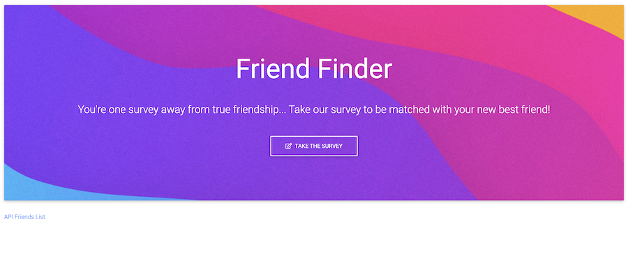
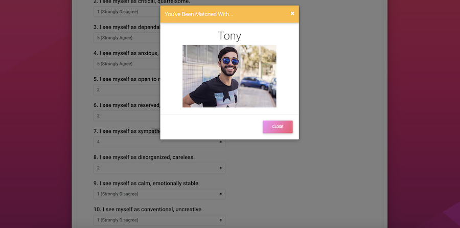

# FriendFinder

An application that matches users with their ideal friend via a personality survey. User's submitted survey answers are compared to the saved answers of others with a custom algorithm. The user will then be matched with the person whose answers most closely match their own. 

The application was built using Node.js, Express, JavaScript, jQuery, HTML, CSS, and the MD Bootstrap framework.

Visit the deployed app on the Heroku platform: [FriendFinder](https://calm-reaches-09158.herokuapp.com/)

---
